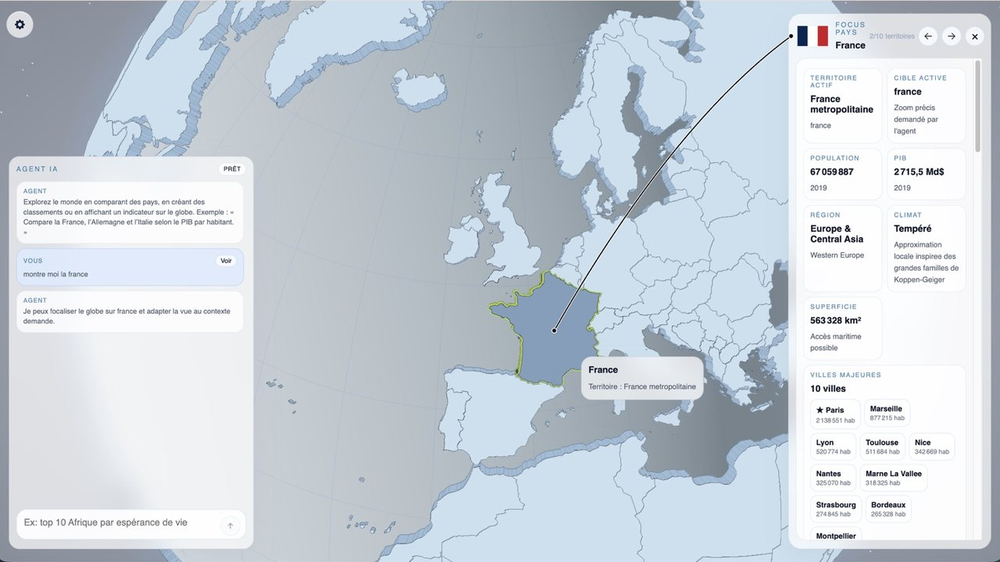
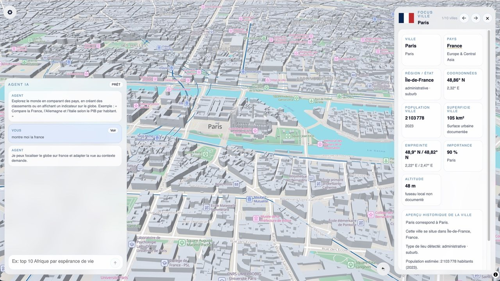
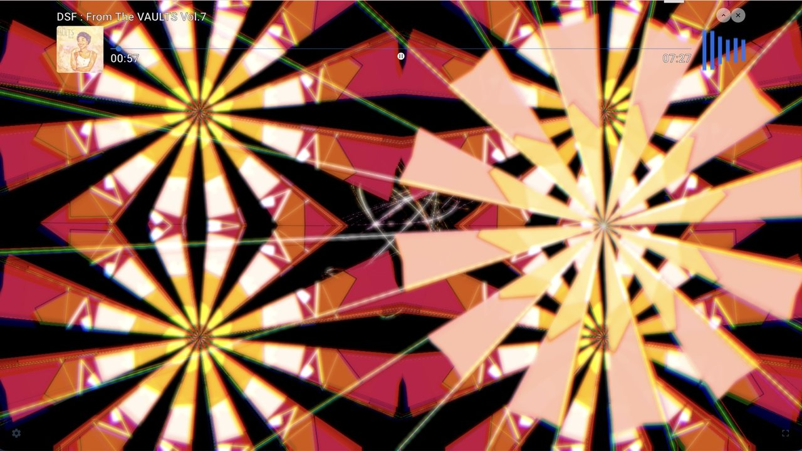
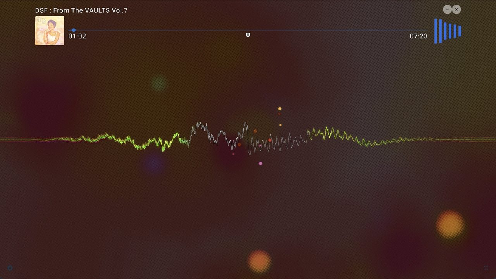

# Manuel Reismann

### Creative Developer & Senior Front-End Engineer

I build interactive web experiences at the intersection of **code, data, graphics and sound**.

My background combines front-end engineering with creative development — from complex React applications to real-time data visualization, WebGL experiences and audio-reactive interfaces.

---

### What I work with

**Front-end**  
React · TypeScript · JavaScript · Next.js

**Creative & Data**  
Three.js · WebGL · GLSL · Data Visualization · Real-time Graphics

**Beyond the browser**  
Node.js · REST APIs · Capacitor · PostgreSQL

**Currently exploring**  
Generative AI · WebGPU · Creative Coding

---

## Selected work

### 🌍 PlanetLive

  
  

**AI-assisted interactive 3D globe for geographic, historical & geopolitical data exploration and country comparison.**

Explore countries and world data through interactive cartography, visual comparisons and AI-assisted queries.

→ [**Explore PlanetLive**](https://www.planet-live.fr)

---

### 🎵 Audiografik

  
  

**Audio-reactive visualization for web & iOS, built with WebGL & GLSL.**

An experimental music visualization experience combining real-time audio analysis, shaders and interactive graphics.

→ [**Explore Audiografik**](https://www.audiografik.net)

---

### 🎸 RhythmTrainer

**Interactive rhythm training application.**

A music-focused application for practicing rhythm through interactive exercises.

---

### About me

I'm particularly interested in projects where engineering meets **visualization, interaction, music, culture and creative technology**.

🌐 [**Portfolio — m4nu.net**](https://www.m4nu.net)  
💼 [**LinkedIn**](https://www.linkedin.com/in/manuel-reismann-6446324)
